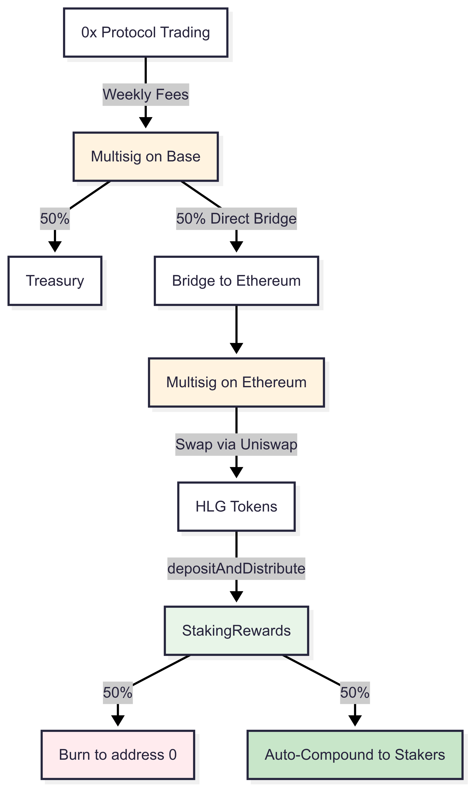

# Audit Scope - HLG Staking Bootstrap Strategy

## Context

We're launching HLG token staking rewards using a simplified manual operational model rather than our full automated cross-chain protocol. This bootstrap approach lets us get to market quickly while validating tokenomics before building the complete automated infrastructure.

The core concept: instead of complex LayerZero cross-chain messaging and automated DEX swaps, we'll manually bridge fees from Base to Ethereum weekly and call a single new function that handles the burn/reward distribution.

## What Needs Auditing

**Primary Contract**: `src/StakingRewards.sol` (630 lines)

This is the only new contract requiring audit. It handles HLG token staking with auto-compounding rewards and a configurable burn percentage.

**Key Functions**:

`stake(uint256 amount)` (lines 124-139):
- Primary user-facing function to stake HLG tokens
- Triggers auto-compounding of any pending rewards via `updateUser()`
- Transfers HLG from user to contract with fee-on-transfer protection
- Updates user balance and global staking totals
- Tracks new stakers for analytics

`depositAndDistribute(uint256 hlgAmount)` (lines 189-209):
- Manual bootstrap reward distribution 
- Takes HLG from owner, splits based on `burnPercentage` (default 50/50)
- Burns portion via HLG token's `burn()` function, auto-compounds remainder

`addRewards(uint256 amount)` (lines 217-238):
- Future automated reward distribution from FeeRouter
- Same burn/reward logic as depositAndDistribute but called by FeeRouter

`unstake()` (lines 145-159):
- Allows users to fully withdraw their stake including all auto-compounded rewards
- Triggers auto-compounding via `updateUser()` before withdrawal
- Transfers full balance (original stake + all rewards) back to user
- Updates global counters and resets user state

`emergencyExit()` (lines 165-177):
- Emergency withdrawal function that works even when contract is paused
- Withdraws current balance without triggering reward update
- User forfeits any pending rewards not yet compounded
- Designed for critical situations requiring immediate exit

`batchStakeFor()` (lines 526-569):
- Referral rewards initialization (up to 250M HLG total, max 780K per user)
- Owner-only, paused-only, gas-optimized batch processing

`stakeFromDistributor()` (lines 591-609):
- Allows whitelisted contracts to stake on behalf of users
- For future campaigns like Merkle drops, quest rewards, etc.

**External Dependencies**:
- Existing HLG token at `0x740dF024Ce73F589AcD5E8756B377eF8C6558BaB` on Ethereum mainnet
- This token implements `ERC20Burnable` interface (has a `burn()` function)
- OpenZeppelin contracts for access control, reentrancy guards, pausable functionality

## Operational Flow



Weekly process:
1. 0x Protocol generates trading fees on Base
2. Multisig splits: 50% to treasury, 50% bridged to Ethereum
3. Ethereum multisig swaps ETH → HLG on Uniswap
4. Call `depositAndDistribute()` with the HLG amount
5. Contract burns 50%, auto-compounds 50% to all stakers

This replaces what would eventually be a complex system involving LayerZero V2 cross-chain messaging, automated Uniswap swaps, and multiple contracts across chains.

## Auto-Compounding Mechanism

The contract implements automatic reward compounding using the proven MasterChef V2 algorithm. Unlike traditional staking where users must manually claim and restake rewards, this system automatically increases user balances as rewards are distributed.

**How it works**:

1. **Global Reward Index**: The contract maintains a `globalRewardIndex` that tracks cumulative rewards per staked token (scaled by 1e12 for gas efficiency)
2. **User Snapshots**: Each user has a `userIndexSnapshot` recording the global index at their last interaction
3. **Automatic Compounding**: When a user interacts with the contract (stake, unstake, or updateUser), pending rewards are calculated and automatically added to their balance:
   ```
   pendingRewards = userBalance * (globalRewardIndex - userIndexSnapshot) / 1e12
   newBalance = currentBalance + pendingRewards
   ```
4. **Reward Distribution**: When new rewards arrive via `depositAndDistribute()` or `addRewards()`:
   - Configured percentage is burned (default 50%)
   - Remainder increases the global index: `globalRewardIndex += (rewards * 1e12) / totalStaked`
   - All stakers' balances grow proportionally without any action required

**Benefits**:
- No gas costs for claiming rewards
- Compound interest effect maximizes returns
- O(1) gas complexity regardless of number of stakers
- Set-and-forget user experience

## Security Considerations

**Access Control**: Owner-only functions include reward distribution, referral initialization, emergency recovery. Owner is a multisig wallet.

**Burn Mechanism**: Uses the HLG token's native `burn()` function with supply reduction verification to ensure burns actually reduce total supply.

**Auto-Compounding Math**: Uses high-precision math (1e12 scaling) to track rewards proportionally across all stakers. Rounding always favors the protocol to prevent exploitation.

**Fee-on-Transfer Protection**: The `_pullHLG()` function explicitly rejects tokens that take fees on transfer, requiring exact amounts received.

**Pausable Design**: Contract starts paused. When paused, users can withdraw but cannot stake. Reward distribution and distributor staking also blocked while paused.

**Emergency Recovery**: Multiple recovery mechanisms for different scenarios:
- `recoverExtraHLG()` - recover HLG accidentally sent to contract
- `reclaimUnallocatedRewards()` - reclaim rewards when no active stakers  
- `sweepETH()` - recover accidentally sent ETH

**Reentrancy Protection**: All external functions use OpenZeppelin's `nonReentrant` modifier.

## Supporting Code (Reference Only)

While not requiring audit, these files provide context for understanding the system:

**Scripts** (`script/`):
- `DeployEthereum.s.sol` - Deployment script for the StakingRewards contract
- `ProcessReferralCSV.s.sol` - Referral rewards batch processing script
- `ts/multisig-cli.ts` - TypeScript tooling for multisig operations
- `ts/services/StakingService.ts` - Service layer for staking operations

**Tests** (`test/`):
- `StakingRewards.t.sol` - Unit tests covering all staking scenarios
- `invariant/StakingRewardsInvariants.t.sol` - Property-based testing
- `mock/MockHLG.sol` - Test implementation of HLG token interface

**Documentation** (`docs/`):
- `BOOTSTRAP_STRATEGY.md` - Detailed explanation of the manual operational model
- `STAKING_REWARDS.md` - Technical documentation of the staking system
- `MULTISIG_FEE_FLOW.md` - Multisig operation procedures

## Out of Scope

- Full cross-chain protocol contracts (not being deployed)
- HolographERC20.sol (reference only - we use existing HLG token)
- LayerZero integration contracts
- Automated DEX swap contracts
- Any contracts in `src/` other than `StakingRewards.sol`

## Testing

The contract has extensive test coverage including:
- Unit tests for all staking scenarios (stake, unstake, emergency exit)
- Reward distribution and auto-compounding logic verification
- Unstake flow testing including full balance withdrawal with compounded rewards
- Emergency functions and edge cases (paused state, zero stakers, etc.)
- Invariant tests ensuring critical accounting identities hold
- Gas optimization verification

All tests pass with Solidity 0.8.30.