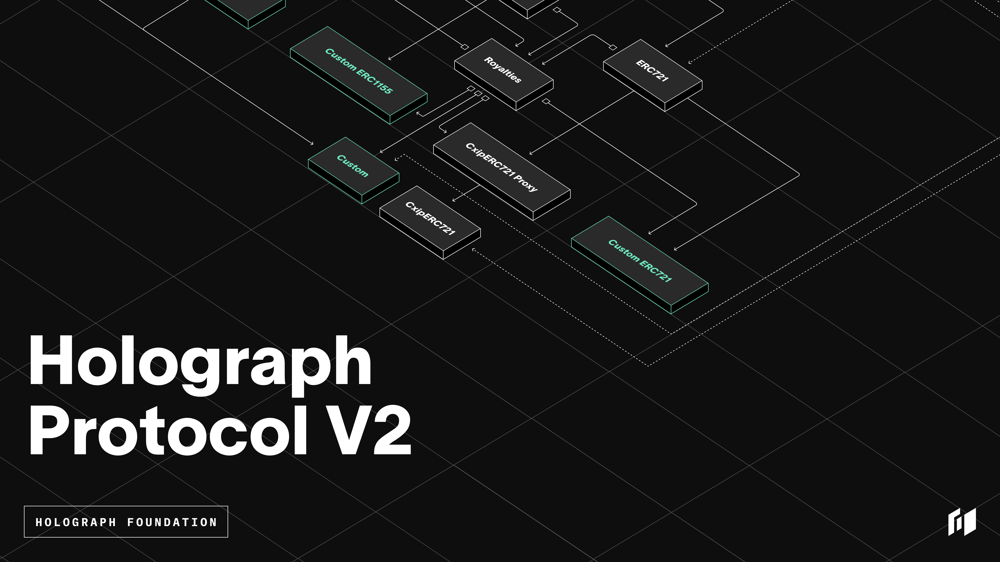

<div align="center">
  <a href="https://holograph.xyz"></a>
  <br />
  <h1>Holograph Protocol V2</h1>
</div>


## Table of Contents

- [Description](#description)
- [Specification](#specification)
- [Architecture](#architecture)
- [Development](#development)
- [Directories](#directory-structure)
- [Branching](#branching-model-and-releases)
- [Contributing](#contributing)
- [Links](#official-links)
- [License](#license)

## Description

Holograph is an omnichain tokenization protocol, enabling asset issuers to mint natively composable omnichain tokens. Holograph works by burning tokens on the source chain, sending a message via a messaging protocol to the destination chain, and then reminting the same number of tokens to the same contract address. This unifies liquidity, eliminates slippage, and preserves fungibility across blockchains.

## Version

Holograph Protocol has been upgraded to V2. For V1 please see [Holograph Protocol V1](https://github.com/holographxyz/holograph-protocol/tree/holograph-v1).

## Specification

Please reference the [documentation](https://docs.holograph.xyz/about/protocol-specification) for the full technical specification of the protocol.

## Architecture

### Core

#### HolographGenesis.sol

Genesis will be deployed on all blockchains that run and support Holograph Protocol. All main components will be deployed via Genesis. Future blockchains will have a Genesis deployment as well.

#### HolographFactory.sol

Factory enables developers to submit a signed version of the following elements to deploy a _Holographed_ smart contract on the blockchain:

- primary deployment chain
- token type (ERC-20, ERC-721, etc.)
- event subscriptions
- custom smart contract bytecode
- custom initialization code

Any additional blockchains that developers want to support can have the same signed data submitted to Factory, allowing for the creation of an identical _Holographed_ contract.
The primary job of Factory is to:

- allow propagation of exact data across all blockchains
- ensure a proper standard is selected and used
- ensure all deployments succeed and work as expected
- ensure that security is enforced and impenetrable

#### HolographRegistry.sol

Registry is a central on-chain location where all Holograph data is stored. Registry keeps a record of all currently supported standards. New standards can be introduced and enabled as well. Any properly deployed _Holographed_ contracts are also stored as reference. This allows for a definitive way to identify whether a smart contract is secure and properly _Holographed_. Verifying entities will be able to identify a _Holographed_ contract to ensure the highest level of security and standards.

#### HolographBridge.sol

This contract contains the code responsible for all the bridge-out and bridge-in logic required to enable bridging. Bridge is a universal smart contract that functions as the primary entry and exit point for any _Holographed_ tokens to and from all supported blockchains. Bridge validates and ensures integrity and standard enforcement for every Bridge-In and Bridge-Out request. Additionally, Bridge implements a universal standard for sending tokens across blockchains by abstracting away complexities into sub-modules that remove the burden of management for developers. This allows for simple one-click/one-transaction native gas token payment-based interactions for all bridge requests.

#### HolographOperator.sol

Operator's primary job is to know the messaging protocols that are utilized by the Holograph protocol for all cross-chain messages, and to ensure the authenticity and validity of all requests being submitted. Operator ensures that only valid bridge requests are sent/received and allowed to be executed inside of the protocol.

#### Holograph.sol

Holograph is the primary entry-point for all users and developers. A single, universal address across all blockchains will enable developers an easy way to interact with the protocol’s features. Holograph keeps references for all current Registry, Factory, and Bridge implementations. Furthermore, it allows for single interface management of the underlying Holograph Protocol.
Holograph provides a reference to the name and ID of all supported blockchains. Additionally, it:

- Enables custom smart contract logic that is chain-dependent
- Frees developers from having to query and monitor the blockchain

### Standards Enforcers

#### Holographer.sol

Holographer exists at the core of all _Holographed_ smart contracts, which is applied whenever a _Holographed_ smart contract is deployed. Holographer pieces together all components and routes all inbound function calls to their proper smart contracts, ensuring security and the enforcement of specified standards. Holographer is isolated on its own private layer and is essentially hard-coded into the blockchain.

#### Enforcer.sol

Enforcer enables and ensures complete standards, compliance, and operability for a given standard type. HolographERC20 and HolographERC721 are perfect examples of such Enforcers. Enforcers store and manage all data within themselves to ensure security, compliance, integrity, and enforcement of all protocols. Communication is established with custom contracts via specific event hooks. The storage/data layer is isolated privately and not directly accessible by custom contracts.

#### HolographRoyalties.sol

HolographRoyalties is an on-chain royalties contract for non-fungible token types. It supports a universal module that understands and speaks all of the different royalty standards on the blockchain. HolographRoyalties is built to be extendable and can have new royalty standards implemented as they are created and agreed upon.

#### Interfaces.sol

The Interfaces contract is used to store and share standardized data. It acts as an external library contract. This allows all the Holograph protocol smart contracts to reference a single instance of data and code.

### External Components

#### Custom Contract

Custom contract is any type of smart contract that was developed outside of Holograph Protocol, and is used to create a _Holographed_ contract. This empowers developers to build their projects however they want. The requirements for enabling a custom contract to be Holograph-able are minimal, and allow for even novice-level developers to implement. Any current and future fungible and non-fungible token type contracts can easily be made Holograph-able.

#### H Tokens

##### Develop

hETH: 0xFFab4710eD70C14878D9FAb1d37E9e3C9276e5ef
hBNB: 0x9BecEaD6FD33AcfE6B096cAf0c619E14e709991B
hAVAX: 0x39d587b08ea8aE448Cf447dd9fc05C6D8A0A92B8
hMATIC: 0xd6F1E7272c783E99eE508A0905Ed98a743C72d09
hMNT: 0x18cc1d7311122561210655c1abae70C1D27466A1

##### Testnet

hETH: 0xB019322549D380C6bC7CbC6628ff29455fe4C1cC
hBNB: 0xA1a98BCE0BDb2770dAfb3588d4457887f5E19434
hAVAX: 0x9dA278F042213B5E8a8e18499CB3B5073d585660
hMATIC: 0x4Fd9Be1a583F4da78362aCf92942d01C46269dF0
hMNT: 0xcF26eb593C244fa62E35b08DaD45136b75690841

##### Mainnet

hETH: 0x82904Fa267EC9588E5cD5A91Ec28ea11EA69182F
hAvax: 0xA84C9B6bA6Fb90EA29AA5391AbB313483AAD1fB5
hBNB: 0x6B3498725726C1D5925015CF19bd79A22C55b330
hMNT: 0x614dcA9aCE2ceA0a89320B0C8C43549848498BD6
hMatic: 0x37fD830b1219b88e845ac76fC397948d48A4eA02

## Important Flows

### Bridging NFTs

To bridge NFTs, a _Holographed_ contract must be deployed and NFTs minted from the contract. Doing so will ensure that the contract address and token IDs remain the same on all deployed blockchains.

### Estimating Gas

TBD

### Bridging Out

The simplified code path for bridging out is:

1. `HolographBridge.sol` - `bridgeOutRequest` method
2. `HolographRegistery.sol` - `_isHolographedContract` method
3. `enforcer/HolographERC721.sol` - `_bridgeOut` method [This is the Collection Contract]
4. `HolographOperator.sol` - `send` method
5. `Holograph/LayerZeroModule.sol` - `send` method

At step 1, a user submits their bridge request with a valid payload using the estimatedGas value computed in the previous [Estimate Gas](#estimategas) section

At step 2, the code checks that the contract is a _holographable_ contract. This means it has implemented the required functions for a _Holographed_ contract. See `src/enforcer/HolographERC721.sol` for an example.

At step 3, we call the `_bridgeOut` function on the _Holographed_ contract and apply various checks and generate a payload with information about the bridge request.

At step 4, we call the `send` method on the `HolographOperator.sol` contract. This method does some final packaging of the payload that will be sent to the messaging layer.

At step 5, we finally call the `send` method to the messaging layer contract `/module/LayerZeroModule.sol`. At this point the NFT has left the source chain.

### Bridging In

The simplified code path for bridging in is:

1. `module/LayerZeroModule.sol` - `lzReceive` method
2. `HolographOperator.sol` - `crossChainMessage` method
3. `HolographOperator.sol` - Emits event `AvailableOperatorJob(jobHash, bridgeInRequestPayload);`

At step 1, the configured messaging layer calls the method `lzReceive` in `module/LayerZeroModule.sol`. We do some checks to make sure only LayerZero call this method.

At step 2, we call `crossChainMessage` on the `HolographOperator.sol` contract. We encode the job, select a primary operator, and 5 substitute operators.

At step 3, the contract will emit a job event. This job event is being observed by our CLI that will then finalize a job. Only users who are in a pod are allowed to finalize jobs.

### Operating

Operators execute destination chain bridge transaction. Operators must run the CLI, bond the protocol’s native token, and execute transactions. The probability of getting selected to perform this work is based on the number of tokens bonded.

### Bonding tokens

There is a testnet faucet available for getting testnet tokens. These are the tokens you need to be able to bond to a pod and operate. Currently deployed Faucet address can be found in the `deployments` dir. Choose the environment/branch, network, and the file will be `Faucet.json`.

### Joining Pods

To become an operator, you must view the pods available to join, select a pod, and bond at least the minimum bond requirement.

1. `HolographOperator.sol` - `getTotalPods`
2. `HolographOperator.sol` - `getPodBondAmounts`
3. `HolographOperator.sol` - `bondUtilityToken`

At step 1, you call `getTotalPods` method to get a list of available pods. If the length of pod is zero, then you can bond into pod `1`.

At step 2, when you call `getPodBondAmounts`, you will get two values: [`_base`, `current`]. The `base` value represents the original minimum bond requirement to join the pod, while the `current` value is the current amount you must provide to join the pod.

At step 3, you are now able to call the `bondUtilityToken` function with the pod and amounts you want to use to enter the pod. Please note, there is a minimum bond requirement to join but no maximum.

### Leaving Pods

To leave a pod, you have to call the `unbondUtilityToken` in `HolographOperator.sol`.

### Processing Jobs

You must join a pod to become an operator. The simplified code path for operating is:

1. Receive new Block from the network
2. Iterate over block looking for event `AvailableOperatorJob(jobHash, bridgeInRequestPayload);`
3. `HolographOperator.sol` - `getJobDetails` method
4. `HolographOperator.sol` - `jobEstimator` method
5. `HolographOperator.sol` - `executeJob` method

At step 1, the CLI connected via websocket receives notification that new block was mined.

At step 2, the CLI makes a request for the full block information. It then iterates over transactions, looking for the `AvailableOperatorJob` event.

At step 3, the CLI then calls `getJobDetails` in `HolographOperator.sol`. This checks if the current wallet user is the selected operator or a backup operator. If it is the selected operator, then it will continue. Otherwise, the job is kept in memory for a short time and reviewed again in the future to check the job status.

At step 4, the CLI will estimate the cost of executing the job. This is used to make sure the transaction sent has enough gas to complete.

At step 5, the wallet sends a transaction to the `exectureJob` method on the `HolographOperator.sol` contract. In here, further checks are done to validate the job and user's wallet. After this transaction is mined on the blockchain, the NFT will become finalized and available on the new blockchain.

## Development

### Installing Dependencies

1. This project uses [asdf](https://asdf-vm.com/) for versions management. Install following plugins
   - Install [asdf Node plugin](https://github.com/asdf-vm/asdf-nodejs): `asdf plugin add nodejs https://github.com/asdf-vm/asdf-nodejs.git`
   - Install [asdf pnpm plugin](https://github.com/jonathanmorley/asdf-pnpm): `asdf plugin-add pnpm`
2. Run `asdf install` after to have the correct tool versions.
3. Install dependencies with `pnpm install`.
4. Install Forge globally with `curl -L https://foundry.paradigm.xyz | bash`

### Environment

Please see the sample.env file for the environment variables that need to be configured. There are some notable variables that are important to consider and have set for both local, testnet, and production development and deployments. So make sure these are set:

- `HOLOGRAPH_ENVIRONMENT` should generally be set to `develop` for development and testing. This can be updated to `testnet` for deployment to the live testing environment and finally `mainnet` only for mainnet deployments.

- `LOCALHOST_DEPLOYER_SECRET` make sure this is set to `something` while deploying and testing using your local Anvil chain. See more about [Anvil](https://book.getfoundry.sh/anvil/)

- `DEPLOYER` is required by hardhat deploy so make sure it has a value set. You can use the default first test account that is used by the anvil command in the package.json. Please see sample.env for setting this up.

- `HARDWARE_WALLET_DEPLOYER` this is only used for `testnet` and `mainnet` envs for deployment. This can be set to `0x0` during development.

### Compiling

1. Terminal 1: `pnpm clean-compile`

This runs `hardhat clean` and then `hardhat compile` in sequence. Alternatively you can just run `pnpm compile`.

### Deploying Holograph Protocol

To run the protocol locally, we actually need to run 2 networks `localhost` and `localhost2`. The `pnpm anvil` command will run the blockchains locally. Then the second command will deploy the entire Holograph Protocol to each network.

1. Terminal 1: `pnpm anvil` - This runs `localhost` and `localhost2` blockchain networks
2. Terminal 2: `pnpm deploy-x2` - Deploys protocol on both networks without compiling. The command will ask you to enter `y` to continue twice. If you get an error, make sure you ran `pnpm clean-compile` at least once before!

The expected output is show below. For local development, if addresses are different, please review env variables to make sure you get the correct values.

```bash
👉 Environment: develop

Setting deployer key to 0xdf5295149F367b1FBFD595bdA578BAd22e59f504 as fallback
Starting deploy script: 00_genesis.ts
Deployer: 0xdf5295149F367b1FBFD595bdA578BAd22e59f504
HolographGenesisLocal contract found and verified at 0x4c3BA951A7ea09b5BB57230F63a89D36A07B2992
Exiting script: 00_genesis.ts ✅

Starting deploy script: 01_sources.ts 👇

Deployer address: 0xdf5295149F367b1FBFD595bdA578BAd22e59f504
Deploying to network: localhost
The deployment salt is: 1000
The gas price override is set to: undefined gwei
We are in dry run mode? false
Continue? (y/n)
the future "Holograph" address is 0x17253175f447ca4B560a87a3F39591DFC7A021e3
the future "HolographBridge" address is 0x0af817Df693A292a4b8b9ACC698199333eB0DD9e
the future "HolographBridgeProxy" address is 0x53D2B46b341385bC7e022667Eb1860505073D43a
the future "HolographFactory" address is 0xa574B1A37c9235d19D942DD4393f728d2a646FDe
the future "HolographFactoryProxy" address is 0xcE2cDFDF0b9D45F8Bd2D3CCa4033527301903FDe
the future "HolographOperator" address is 0x0d173B3F4Da8e50333734F36E40c5f475874A7b3
the future "HolographOperatorProxy" address is 0xABc5a4C81D3033cf920b982E75D1080b91AA0EF9
the future "HolographRegistry" address is 0x1052ae1742fc6878010a31aA53671fEF7D51bf65
the future "HolographRegistryProxy" address is 0xB47C0E0170306583AA979bF30c0407e2bFE234b2
the future "HolographTreasury" address is 0x76c4fC0627405741Db0959E66d64c0ECeAceDC94
the future "HolographTreasuryProxy" address is 0x65115A3Be2Aa1F267ccD7499e720088060c7ccd2
the future "HolographInterfaces" address is 0x67F6394693bd2B46BBE87627F0E581faD80C7B57
the future "HolographRoyalties" address is 0xbF8f7474D7aCbb87E270FEDA9A5CBB7f766887E3
Using deployerAddress from signer 0xdf5295149F367b1FBFD595bdA578BAd22e59f504
the future "HolographUtilityToken" address is 0x56BA455232a82784F17C33c577124EF208D931ED
"Holograph" bytecode not found, need to deploy"
future "Holograph" address is 0x17253175f447ca4B560a87a3F39591DFC7A021e3
... // more logs
```

### Slots

A note on contract slots. The protocol uses the EIP1967 standard heavily for addressing storage location via slots. We use a consistent format across the codebase
in the form of:

eip1967.<contract-name>.<storage-variable-name>

Additionally we have a utility script that indentify this within the contracts directory as a pre-commit and auto-hash it into it's proper format prior to pushing updates to the repo. An example of how to add a new storage variable to a contract via a hashed slot is as followed:

1. Add a variable to your contracts storage such as `bytes32 constant _interfacesSlot = precomputeslot("eip1967.Holograph.interfaces");`. Add slots below existing slots. Never add them in between existing slots.
2. Run the `npx ts-node scripts/precompute-solidity-hashes.ts` script to update the contents of the `precompute` slot function into the output of the hash that is actually stored in the contract.
3. Annotate the converted line with a comment so the original value is captured. See existing slot to see how we comment these values. We should be able to see what the string version of the hash is.
4. These constants provide access to important variables at a unique location in a consistent manner.

Note, that if you do not manually call the `precompute-solidity-hashes.ts` script, we have a git hook that will automatically convert it.

### Quick Environment Commands

You can set up aliases locally to make development smoother. Note, that you will need to update the path to the code to the location on your own computer.

```shell
alias protbuild="cd ~/path/to/protocol && pnpm install && pnpm clean-compile && pnpm anvil"

alias protdeploy="cd ~/path/to/protocol && pnpm deploy-x2"
```

Then you can run `protbuild` and then `protdeploy` to set up the project locally.

### Running tests

> NOTE: At this time some tests require hardcoded referencing hardcoded addresses on the local network that are deployed deterministically based on a salt parameter that is stored in the `.env` file. For local development, please set `DEVELOP_DEPLOYMENT_SALT=1000`.

There are two sets of tests. The main test suite uses Hardhat. To run them start your local chains that the contracts will be deployed to using:

`pnpm anvil`

Keep in mind that two networks are spun up in order to facilitate the multichain tests that bridge from one network to the other.
Next run the hardhat tests with:

`pnpm test`

The newer tests for Drops use Foundry. Please make sure you have Foundry installed by following the instructions [here](https://github.com/foundry-rs/foundry).

Currently, the Foundry tests require "forking" from a local chain that has the rest of the Holograph protocol contracts already deployed. To do this, with the local anvil chains still running from the `anvil` command mentioned above, run deploy with:

`pnpm deploy:localhost`

Then you can run the Foundry tests with:

`forge test`

### Making Changes

**Before pushing your work to the repo, make sure to prepare your code**

Please make use of the `pnpm run prettier:fix` command to format the codebase into a universal style.

## Directory Structure

<pre>
root

├── <a href="./config">config</a>: Network configuration files
├── <a href="./src">contracts</a>: Smart contracts that power the Holograph protocol
├── <a href="./deploy">deploy</a>: Deployment scripts for the smart contracts uses <a href="https://hardhat.org/">Hardhat</a> and <a href="https://github.com/wighawag/hardhat-deploy">Hardhat Deploy</a>
├── <a href="./deployments">deployments</a>: Deployment build files that include contract addresses on each network
├── <a href="./scripts">scripts</a>: Scripts and helper utilities
└── <a href="./test">test</a>: Hardhat tests for the smart contracts
</pre>

## Branching Model and Releases

### Active Branches

| Branch                                                                               | Status                                                                             |
| ------------------------------------------------------------------------------------ | ---------------------------------------------------------------------------------- |
| [mainnet](https://github.com/holographxyz/holograph-protocol/tree/mainnet)           | Accepts PRs from `testnet` or `release/x.x.x` when we intend to deploy to mainnet. |
| [testnet](https://github.com/holographxyz/holograph-protocol/tree/testnet)           | Accepts PRs from `develop` that are ready to be deployed to testnet.               |
| [develop](https://github.com/holographxyz/holograph-protocol/tree/develop)           | Accepts PRs from `feature/xyz` branches that are experimental or in testing stage. |
| [experimental](https://github.com/holographxyz/holograph-protocol/tree/experimental) | Accepts PRs from any branches.                                                     |
| release/x.x.x                                                                        | Accepts PRs from `testnet`.                                                        |

### Overview

We generally follow [this Git branching model](https://nvie.com/posts/a-successful-git-branching-model/).
Please read the linked post if you're planning to make frequent PRs into this repository.

### The `mainnet` branch

The `mainnet` branch contains the code for our latest "stable" mainnet releases.
Updates from `mainnet` always come from the `testnet` branch.
We only ever update the `mainnet` branch when we intend to deploy code that has been tested on testnets to all mainnet networks supported by the Holograph protocol.
Our update process takes the form of a PR merging the `testnet` branch into the `mainnet` branch.

### The `testnet` branch

The `testnet` branch continas the code that is the latest stable testnet release for all supported networks. This branch is deployed and circulated for beta users of the protocol. Updates are merged in from the `develop` branch once they're ready for broad usage.

### The `develop` branch

Our primary development branch is [`develop`](https://github.com/holographxyz/holograph-protocol/tree/develo).
`develop` contains the most up-to-date software that is being tested via experimental network deployments.

### The `experimental` branch

Our primary experimentation branch is [`experimental`](https://github.com/holographxyz/holograph-protocol/tree/experimental).
`experimental` contains the software that is not stable and is trying out new code.

## Deployment Process

##### NOTE: If you are deploying with a hardware wallet there is an environment variable HARDWARE_WALLET_ENABLED that MUST be set to true and HARDWARE_WALLET_DEPLOYER must be set to your deployer's address

1. Validate env variables are correct
   1. Check Salts
   2. Check RPCS
   3. Check `HOLOGRAPH_ENVIRONMENT`
2. Check Git commit reference
3. Clean Repo
   1. Remove temp folders: [node_modules, artifacts, cache, cache_hardhat, dist, typechain-types, ganache]
4. Run Tests
   1. run `pnpm clean-compile`
   2. run `pnpm anvil` - terminal 1
   3. run `pnpm deploy` - terminal 2
5. Run Deployments per environment, per supported network
6. Validate Contracts on each network

## Contributing

Read through [CONTRIBUTING.md](./CONTRIBUTING.md) for a general overview of our contribution process.

## Official Links

- [Website](https://holograph.xyz)
- [App](https://app.holograph.xyz)
- [Docs](https://docs.holograph.xyz)
- [Discord](https://discord.com/invite/holograph)
- [Twitter](https://twitter.com/holographxyz)

## License

Files under this repository are licensed under [Holograph Limited Public License](https://github.com/holographxyz/holograph-protocol/blob/testnet/LICENSE.md) (H-LPL) 1.0.0 unless otherwise stated.
