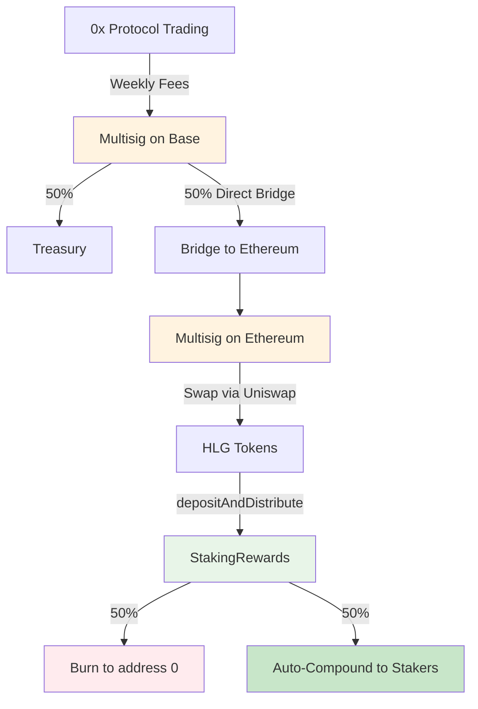

# Holograph Protocol Rewards Bootstrap Strategy

## Overview

I propose we launch HLG staking rewards with a manual operational model instead of our full automated cross-chain infrastructure. This gets us to market faster with the same economic outcomes while drastically reducing technical complexity.

## Why Bootstrap?

Our full protocol design requires:
- Cross-chain messaging via LayerZero V2
- Automated Uniswap V3 swaps in smart contracts
- Complex fee routing across Base and Ethereum
- Extensive audits across multiple contracts

The bootstrap approach achieves the same result with:
- Manual weekly operations (30 minutes)
- Existing bridge and DEX infrastructure
- Single new function in StakingRewards contract
- Minimal audit scope

## Process Flow



## Technical Requirements

We need one new function in StakingRewards:

```solidity
function depositAndDistribute(uint256 hlgAmount) external onlyOwner {
    hlg.transferFrom(msg.sender, address(this), hlgAmount);
    
    uint256 burnAmount = hlgAmount / 2;
    uint256 rewardAmount = hlgAmount - burnAmount;
    
    hlg.transfer(address(0), burnAmount);
    _distributeRewards(rewardAmount);
    
    emit HLGDeposited(hlgAmount, burnAmount, rewardAmount);
}
```

That's it. No LayerZero, no automated swaps, no complex cross-chain messaging.

## Weekly Operations

1. Execute multisig: 50% treasury, 50% bridge to Ethereum
2. From Ethereum multisig: swap ETH → HLG on Uniswap V3
3. Call `depositAndDistribute()` on StakingRewards
4. Verify burn and distribution events

Total time: ~30 minutes per week.

## Migration Path

Once we validate product-market fit:
1. Deploy the full automated protocol
2. Audit the complete cross-chain infrastructure
3. Gradually transition from manual to automated operations
4. Preserve all staking history and balances

## Benefits vs Full Protocol

**Bootstrap:**
- Ship immediately with minimal contract changes
- Test tokenomics with real users
- Adjust parameters based on market feedback
- Minimal audit requirements

**Full Protocol (Later):**
- Fully automated cross-chain operations
- No manual intervention required
- Scale to handle any volume
- Complex integrations with LayerZero and Uniswap

## Recommendation

Let's start with the bootstrap approach. We can validate demand for HLG staking rewards without the complexity of cross-chain automation. If users love it, we build the full system. If we need to adjust, we haven't over-invested in infrastructure.

The economics are identical - users get the same rewards whether we automate or operate manually. The only difference is 30 minutes of our time each week until we're ready to scale.