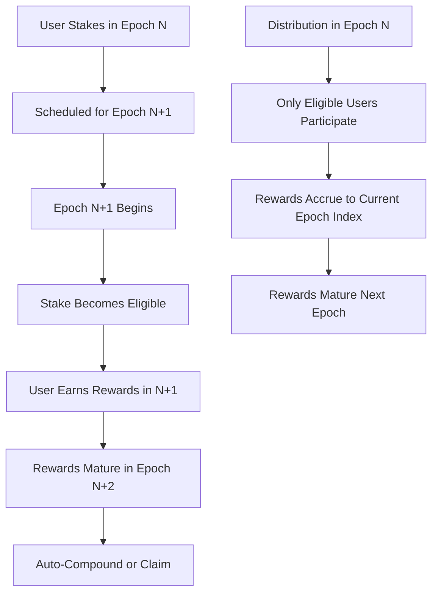

# Epoch System Architecture

## Overview

The Holograph Protocol StakingRewards contract implements a sophisticated epoch-based staking mechanism to address critical security vulnerabilities while maintaining the efficiency of the MasterChef V2 algorithm. This document explains the architectural changes and how they solve two major security issues identified during audit.

## Security Issues Addressed

### Issue #1: Reward Distribution Sandwich Attacks

**Problem**: The original `depositAndDistribute()` function distributed rewards instantly based on current stake ratios, allowing attackers to:
1. Frontrun reward distributions with large stakes
2. Capture disproportionate rewards 
3. Immediately unstake after distribution

**Impact**: High - Could drain protocol rewards through MEV attacks

### Issue #2: Compounding Frequency Advantage

**Problem**: Users who called `updateUser()` more frequently earned more rewards due to compound timing:
1. Frequent callers got rewards added to balance sooner
2. Compounded amounts earned additional rewards in subsequent distributions
3. Created unfair advantage for active vs passive users

**Impact**: Medium - Passive users systematically disadvantaged

## Epoch System Solution

### Core Concept

The epoch system introduces **time-gated eligibility** where:
- Epochs run for exactly 7 days (604,800 seconds)
- Stakes become eligible for rewards in the **next** epoch
- Withdrawals finalize in the **next** epoch
- All users in an epoch have equal compounding opportunities

### Key Components

#### 1. Epoch Timing
```solidity
uint256 public constant EPOCH_DURATION = 7 days;
uint256 public epochStartTime;
uint256 public lastProcessedEpoch;

function currentEpoch() public view returns (uint256) {
    if (epochStartTime == 0) return 0;
    return (block.timestamp - epochStartTime) / EPOCH_DURATION;
}
```

#### 2. Activation Scheduling
```solidity
mapping(address => uint256) public pendingActivationEpoch;
mapping(address => uint256) public eligibleBalanceOf;
```

New stakes are scheduled for activation in epoch N+1, preventing same-block sandwich attacks.

#### 3. Dual-Index Reward System
```solidity
uint256 public globalRewardIndex;
uint256 public currentEpochRewardIndex;
mapping(uint256 => uint256) public epochRewardIndex;
```

Maintains both global rewards (for immediate claiming) and epoch-specific rewards (for fair distribution).

## Architecture Deep Dive

### Epoch Lifecycle



### State Transitions

#### Epoch Advancement
```solidity
function _advanceEpoch() internal {
    uint256 currentEpoch = (block.timestamp - epochStartTime) / EPOCH_DURATION;
    if (currentEpoch > lastProcessedEpoch) {
        // Process all scheduled changes atomically
        eligibleTotal = eligibleTotal + scheduledAdditionsNextEpoch - scheduledRemovalsNextEpoch;
        
        // Handle accounting edge cases
        if (scheduledRemovalsNextEpoch > eligibleTotal + scheduledAdditionsNextEpoch) {
            emit AccountingError(eligibleTotal + scheduledAdditionsNextEpoch, scheduledRemovalsNextEpoch);
            eligibleTotal = 0;
        }
        
        // Reset schedules for next epoch
        scheduledAdditionsNextEpoch = 0;
        scheduledRemovalsNextEpoch = 0;
        lastProcessedEpoch = currentEpoch;
        
        emit EpochAdvanced(currentEpoch);
    }
}
```

#### User Activation
```solidity
function _activateUserIfEligible(address account) internal {
    uint256 activationEpoch = pendingActivationEpoch[account];
    if (activationEpoch > 0 && activationEpoch <= lastProcessedEpoch) {
        // User becomes eligible - transfer from pending to active
        uint256 pendingAmount = pendingStakeBalance[account];
        eligibleBalanceOf[account] += pendingAmount;
        pendingStakeBalance[account] = 0;
        pendingActivationEpoch[account] = 0;
    }
}
```

## Security Properties

### Sandwich Attack Prevention

**Before (Vulnerable)**:
```solidity
// Attacker can frontrun this transaction
function depositAndDistribute(uint256 hlgAmount) external {
    uint256 staked = _activeStaked(); // Current stake at this block
    _addRewards(rewardAmount); // Instant distribution
}
```

**After (Protected)**:
```solidity
// Distribution uses fixed eligible set from epoch start
function depositAndDistribute(uint256 hlgAmount) external {
    _advanceEpoch(); // Ensure current epoch state
    // eligibleTotal is fixed until next epoch
    if (eligibleTotal > 0) {
        uint256 indexIncrease = (rewardAmount * INDEX_PRECISION) / eligibleTotal;
        currentEpochRewardIndex += indexIncrease;
    }
}
```

**Protection Mechanism**:
- New stakes cannot participate until next epoch (minimum 1 second, maximum 7 days delay)
- `eligibleTotal` is fixed at epoch boundaries
- No same-block stake → reward → unstake possible

### Compounding Fairness

**Before (Unfair)**:
```
Alice stakes 1000, calls updateUser() → compounds to 1050
Bob stakes 1000, doesn't call updateUser() → stays at 1000
Next distribution: Alice earns on 1050, Bob earns on 1000
```

**After (Fair)**:
```
Alice stakes 1000 in epoch N → eligible in epoch N+1
Bob stakes 1000 in epoch N → eligible in epoch N+1  
Rewards in epoch N+1 → both earn equally
Compounding scheduled for epoch N+2 → both activate equally
```

**Fairness Mechanism**:
- All users in same epoch have identical activation timing
- Compounded rewards scheduled for next epoch activation
- No advantage from frequent `updateUser()` calls

## Implementation Details

### Gas Optimization

The system maintains O(1) gas complexity through:
- Fixed-size epoch windows
- Batch processing of state changes
- Minimal storage reads per operation

### Edge Case Handling

#### Accounting Errors
```solidity
if (scheduledRemovalsNextEpoch > eligibleTotal + scheduledAdditionsNextEpoch) {
    emit AccountingError(eligibleTotal + scheduledAdditionsNextEpoch, scheduledRemovalsNextEpoch);
    eligibleTotal = 0; // Clamp to prevent underflow
}
```

#### Ghost Eligibility Prevention (Critical Fix)
**Issue**: When users have matured pending activation but never call `updateUser()`, their eligibility exists in `eligibleTotal` but not in their individual `eligibleBalanceOf`. Emergency exit could leave this "ghost eligibility" permanently in `eligibleTotal`.

**Solution**: Enhanced `emergencyExit()` function:
```solidity
// Cancel any scheduled activation for next epoch
uint256 pendingAdd = pendingActivationAmount[msg.sender];
if (pendingAdd != 0) {
    uint256 activationEpoch = pendingActivationEpoch[msg.sender];
    // If activation is still pending in a future epoch, remove it from schedule
    if (activationEpoch > lastProcessedEpoch) {
        scheduledAdditionsNextEpoch -= pendingAdd;
    }
    // If activation has matured but user never activated, schedule removal of ghost eligibility
    else if (activationEpoch <= lastProcessedEpoch) {
        scheduledRemovalsNextEpoch += pendingAdd;
    }
    // Clear per-user pending activation state
    pendingActivationAmount[msg.sender] = 0;
    pendingActivationEpoch[msg.sender] = 0;
}
```

**Impact**: Prevents `eligibleTotal` drift that could lead to index precision issues and accumulated unallocated rewards.

#### Dust Amounts
Rewards below the minimum threshold (`(rewardAmount * INDEX_PRECISION) / eligibleTotal == 0`) are rejected to prevent division precision loss.

#### Pause State Operations
Distributions are allowed while paused for operational flexibility, but stake changes require unpaused state.

## Operational Impact

### User Experience

**Staking Flow**:
1. User calls `stake(amount)` in epoch N
2. Stake is scheduled for activation in epoch N+1
3. User must wait for next epoch to earn rewards
4. Rewards auto-compound at epoch boundaries

**Withdrawal Flow**:
1. User calls `unstake()` in epoch N
2. Withdrawal scheduled for epoch N+1
3. User calls `finalizeUnstake()` in epoch N+1 or later
4. Receives principal + any matured rewards

### MEV Protection

The epoch system provides natural MEV protection:
- No profitable frontrunning opportunities
- Predictable reward timing
- Optional pause-during-distribution for additional protection

## Testing Strategy

### Critical Test Cases

1. **Activation Timing**: Verify stakes activate exactly at epoch boundaries
2. **Sandwich Resistance**: Confirm frontrunning provides no advantage
3. **Compounding Fairness**: Equal rewards for equal stakes regardless of update frequency
4. **Ghost Eligibility**: Emergency exit properly handles matured but unactivated rewards
5. **Edge Cases**: Accounting errors, dust handling, pause states

### Invariants

- `eligibleTotal == sum(eligibleBalanceOf[all_users])`
- `scheduledAdditions/Removals` reset to zero after each epoch
- No user can earn rewards before their activation epoch
- All users in same epoch have equal compounding opportunities

## Migration Considerations

### Backward Compatibility

The epoch system is **not** backward compatible. Migration requires:
1. Pause old contract
2. Deploy new epoch-enabled contract
3. Optional: Batch migrate stakes via `stakeFor()` (owner-only, paused-only)
4. Unpause new contract to begin epochs

### State Migration

No automatic state migration - users must manually migrate their stakes or use the batch migration process.

## Conclusion

The epoch system successfully addresses both identified security vulnerabilities while maintaining the efficiency and gas optimization of the original MasterChef V2 architecture. The 7-day epoch duration balances security (preventing attacks) with user experience (reasonable activation delays).

Key benefits:
- **Security**: Eliminates sandwich attacks and compounding advantages
- **Fairness**: Equal treatment for all users within each epoch  
- **Efficiency**: Maintains O(1) gas complexity
- **Flexibility**: Supports operational requirements and future upgrades

The architecture provides a robust foundation for secure, fair, and efficient staking rewards distribution.