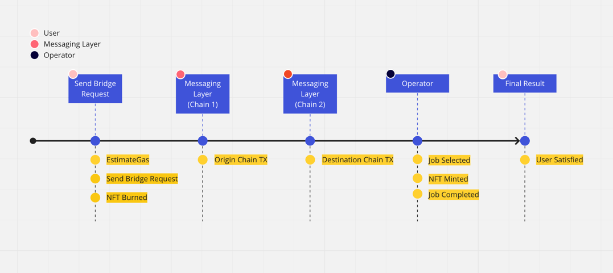
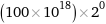

# Important Flows

These flows explain the main functions and code flows that under review for this open audit.

## Primer

To work within the holograph ecosystem, the collection contract must be holographed contract. An example is the contract at `contracts/token/SampleERC721.sol`. This is a basic holographic collection contract that works within our ecosystem. From there you can mint NFTs on the collection.

## Bridging NFTs

Again, to bridge NFT, the contract collection must be a holographed contract! Doing so will ensure that the contract address and token IDs remain the same on all deployed blockchains.

## Estimating Gas

To estimate gas, you have to make a requests to an onchain function with a payload of the message.

1. Generate `crossChainPayload` variable by calling
2. `Holograph/LayerZeroModule.sol` - `getMessageFee` method

At step 1, you have to generate the message payload for your message.

At step 2, from there you pass the data and other information like the chainId and call the `getMessageFee` on the `Holograph/LayerZeroModule.sol` file.

From here you will be able to continue to the next step, which is to send a bridge out request.

## Bridging Out

The simplified code path for bridging from chain A to chain B is:

1. `HolographBridge.sol` - `bridgeOutRequest` method
2. `HolographRegistery.sol` - `_isHolographedContract` method
3. `enforcer/HolographERC721.sol` - `_bridgeOut` method [This is the Collection Contract]
4. `HolographOperator.sol` - `send` method
5. `Holograph/LayerZeroModule.sol` - `send` method

At step 1, a user submits their bridge request with a valid payload using the estimatedGas value computed in the previous [Estimate Gas](#estimategas) section.

At step 2, the code checks that the contract is a _holographable_ contract. This means it has implemented the required functions to be a _Holographed_ contract. See `contracts/token/SampleERC721.sol` as an example.

At step 3, we call the `_bridgeOut` function on the _Holographed_ contract and apply various checks and generate a payload with information about the bridge request.

At step 4, we call the `send` method on the `HolographOperator.sol` contract. This method does some final packaging of the payload that will be sent to the messaging layer.

At step 5, we finally call the `send` method to the messaging layer contract `/module/LayerZeroModule.sol`. At this point the NFT has left the source chain.

## Bridging In

The simplified code path for bridging in is:

1. `module/LayerZeroModule.sol` - `lzReceive` method
2. `HolographOperator.sol` - `crossChainMessage` method
3. `HolographOperator.sol` - Emits event `AvailableOperatorJob(jobHash, bridgeInRequestPayload);`

At step 1, the configured messaging layer calls the method `lzReceive` in `module/LayerZeroModule.sol`. We do some checks to make sure only a LayerZero address calls this method.

At step 2, we call `crossChainMessage` on the `HolographOperator.sol` contract. We encode the job, select a primary operator, and 5 substitute operators.

At step 3, the contract will emit a job event. This job event is being observed by our CLI that will then finalize a job. Only users who are in a pod are allowed to finalize jobs.

## Operating

Operators execute destination chain bridge transaction. Operators must run the CLI, bond the protocol’s native token, and execute transactions. The probability of getting selected to perform this work is based on the number of tokens bonded.

## Joining Pods

To become an operator, you must view the pods available to join, select a pod, and bond at least the minimum bond requirement.

1. `HolographOperator.sol` - `getTotalPods`
2. `HolographOperator.sol` - `getPodBondAmounts`
3. `HolographOperator.sol` - `bondUtilityToken`

At step 1, you call `getTotalPods` method to get a list of available pods. If the length of pod is zero, then you can bond into pod `1`.

At step 2, when you call `getPodBondAmounts`, you will get two values: [`_base`, `current`]. The `base` value represents the original minimum bond requirement to join the pod, while the `current` value is the current amount you must provide to join the pod.

_Minimum Bond Amounts_ are dynamically calculated based on some initial variables. These variables can be changed or set differently for each blockchain. A graphical representation is [available here](https://observablehq.com/@vitto/operator_bonding)

- baseBondAmount = `100 * (10^18)`
- podMultiplier = `2`
- operatorThreshold = `1000`
- operatorThresholdStep = `10`
- operatorThresholdMultiplier = `0.01`

_Pod Threshold_ is calculated by running this formula with a pod number in question:

`operatorThreshold / (2^pod)`

Using the above variables and selecting for `Pod 1` (or `0` in array language), this would result in the number `1000`.

_Minimum Bond Amounts_ are calculated by running this formula with a pod number in question: `baseBondAmount * (podMultiplier^pod)`.

Using the above variables and selecting for `Pod 1` (or `0` in array language), this would result in the number `100000000000000000000`, or `100 HLG` (using 18 decimal places).

_Current Bond Amount_ is calculated by running the _Minimum Bond Amount_ formula above. If the current number of Operators in a specific Pod is greater than the _Pod Threshold,_ then the _Minimum Bond Amount_ needs to be added with `(bondAmount * operatorThresholdMultiplier) * ((position - threshold) / operatorThresholdStep)`

Using the above variables and selecting for `Pod 1` (or `0` in array language) and getting into position `1500`, this would result in the number `150000000000000000000`, or `150 HLG`.

At step 3, you are now able to call the `bondUtilityToken` function with the pod and amounts you want to use to enter the pod. Please note, there is a minimum bond requirement to join but no maximum.

You are now an operator. We will launch a CLI in the future that will process jobs on your behalf.

## Leaving Pods

To leave a pod, you have to call the `unbondUtilityToken` method in `HolographOperator.sol`. The amount withdrawn depends on the slashing state of the operator. An operator is slashed if they fail to complete a job.

| Number of Slashes | Percentage of Bond |
| ----------------- | ------------------ |
| 1                 | 4%                 |
| 2                 | 16%                |
| 3                 | 36%                |
| 4                 | 64%                |
| 5                 | 100%               |

## Processing Jobs

You must join a pod to become an Operator. The simplified code path for operating is:

1. Receive new Block from the network
2. Iterate over block looking for event `AvailableOperatorJob(jobHash, bridgeInRequestPayload);`
3. `HolographOperator.sol` - `getJobDetails` method
4. `HolographOperator.sol` - `jobEstimator` method
5. `HolographOperator.sol` - `executeJob` method

At step 1, the CLI connected via websocket receives notification that new block was mined.

At step 2, the CLI makes a request for the full block information. It then iterates over transactions, looking for the `AvailableOperatorJob` event.

At step 3, the CLI then calls `getJobDetails` in `HolographOperator.sol`. This checks if the current wallet user is the selected operator or a backup operator. If it is the selected operator, then it will continue. Otherwise, the job is kept in memory for a short time and reviewed again in the future to check the job status.

At step 4, the CLI will estimate the cost of executing the job. This is used to make sure the transaction sent has enough gas to complete.

At step 5, the wallet sends a transaction to the `exectureJob` method on the `HolographOperator.sol` contract. In here, further checks are done to validate the job and user's wallet. After this transaction is mined on the blockchain, the NFT will become finalized and available on the new blockchain.
