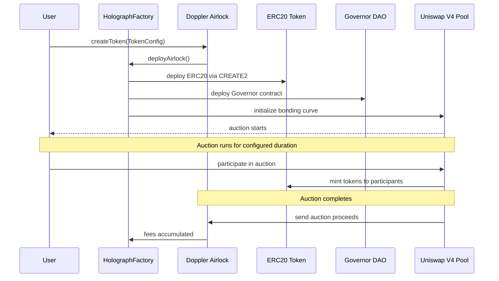
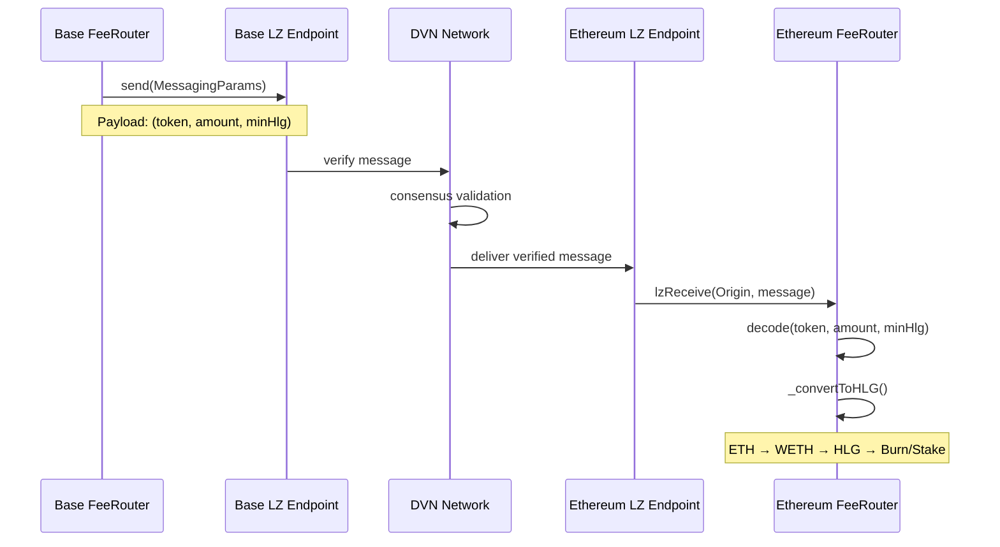

# Holograph Protocol Flow Diagrams

## Master Protocol Flow - Complete System Overview

```mermaid
flowchart TD
    %% Base Chain - Token Creation
    subgraph BASE[" "]
        direction TB
        subgraph TOKEN["Token Creation - Base Chain"]
            U[Users] --> DA[Doppler Airlock]
            DA --> HF[HolographFactory]
            HF --> T[ERC20 Token]
            HF --> UV4[Uniswap V4 Pool]
        end
        
        subgraph SOURCES["Fee Sources"]
            UV4 --> AF[Auction Fees]
            AF --> BFR[FeeRouter Base]
        end
        
        subgraph EXTERNAL["External Fee Source"]
            ZX[0x Protocol Trading] --> |Weekly| MS[Multisig Wallet]
            MS --> |100% Protocol| BFR
        end
        
        subgraph BASEPROC["Base Fee Processing"]
            BFR --> FS{Fee Split 50/50}
            FS --> |Treasury 50%| TR
            FS --> |Protocol 50%| BP[Protocol Fees Ready]
        end
    end
    
    %% LayerZero Bridge
    subgraph LZ["LayerZero V2 Cross-Chain Bridge"]
        direction LR
        BP --> |bridge call| LZE[LayerZero Endpoint]
        LZE <--> DVN[DVN Consensus]
        LZE --> |message| LZRCV[Cross-Chain Message]
    end
    
    %% Ethereum Chain Processing
    subgraph ETH[" "]
        direction TB
        subgraph ETHPROC["Ethereum Fee Processing"]
            LZRCV --> |lzReceive| EFR[FeeRouter Ethereum]
            EFR --> |wrap| WETH[WETH Contract]
            WETH --> |swap| UV3[Uniswap V3 Pool]
            UV3 --> HLG[HLG Tokens]
        end
        
        subgraph TOKENOMICS["HLG Tokenomics"]
            HLG --> HD{Configurable Distribution}
            HD --> |X% Burn| BURN[address 0 - Permanently Removed]
            HD --> |(100-X)% Rewards| SR[StakingRewards Contract]
            SR --> |distribute| STAKERS[HLG Stakers]
        end
    end
    
    %% Styling for better organization
    style BASE fill:#f8f9fa,stroke:#dee2e6,stroke-width:2px
    style ETH fill:#f8f9fa,stroke:#dee2e6,stroke-width:2px
    style LZ fill:#fff3cd,stroke:#ffeaa7,stroke-width:2px
    
    style HF fill:#e3f2fd,stroke:#1976d2,stroke-width:2px
    style BFR fill:#e3f2fd,stroke:#1976d2,stroke-width:2px
    style EFR fill:#e8f5e8,stroke:#388e3c,stroke-width:2px
    style TR fill:#e1f5fe,stroke:#0277bd,stroke-width:2px
    style MS fill:#fff3e0,stroke:#f57c00,stroke-width:2px
    style BURN fill:#ffebee,stroke:#d32f2f,stroke-width:2px
    style SR fill:#e8f5e8,stroke:#388e3c,stroke-width:2px
    style LZE fill:#fff3e0,stroke:#f57c00,stroke-width:2px
    style ZX fill:#f3e5f5,stroke:#7b1fa2,stroke-width:2px
    style UV3 fill:#e8eaf6,stroke:#3f51b5,stroke-width:2px
    style HLG fill:#fff8e1,stroke:#fbc02d,stroke-width:2px
    style DVN fill:#e1f5fe,stroke:#0288d1,stroke-width:2px
```

## 1. Token Creation Flow



## 2. Current Fee Collection (Doppler Airlock)

```mermaid
flowchart TD
    A[Token Auction Completes] --> B[Fees Accumulate in Doppler Airlock]
    B --> C{Owner Triggers Collection}
    C -->|Yes| D[FeeRouter.collectAirlockFees()]
    D --> E[Measure Balance Change]
    E --> F[Split Fees: 50% Protocol / 50% Treasury]
    F --> G[Treasury Paid Immediately]
    F --> H[Protocol Fees Accumulated]
    
    H --> I{On Base Chain?}
    I -->|Yes| J[Bridge to Ethereum via LayerZero V2]
    I -->|No - On Ethereum| K[Convert to HLG Immediately]
    
    J --> L[LayerZero Message Sent]
    L --> M[Received on Ethereum FeeRouter]
    M --> K
    
    K --> N[Swap via Uniswap V3]
    N --> O[WETH → HLG Conversion]
    O --> P[Configurable Burn / Stake Distribution]
    
    P --> Q[HLG Burned to address(0)]
    P --> R[HLG Sent to StakingRewards]
    R --> S[Distributed to HLG Stakers]
```

## 3. New Weekly Multisig Fee Collection

```mermaid
flowchart TD
    A[Weekly 0x Protocol Trading] --> B[Fees Collected by 0x Protocol]
    B --> C[0x Protocol → Multisig Transfer]
    C --> D{Multisig Manual Transfer}
    D --> E[100% → FeeRouter Contract]
    
    F --> G[ETH Balance in FeeRouter]
    G --> H{Owner Triggers Bridge}
    H -->|Yes| I[FeeRouter.bridge()]
    I --> J[LayerZero V2 Cross-Chain Message]
    J --> K[Ethereum FeeRouter Receives]
    
    K --> L[Convert ETH to WETH]
    L --> M[Swap WETH → HLG via Uniswap V3]
    M --> N[Configurable Burn / Stake Distribution]
    
    N --> O[HLG Burned to address(0)]
    N --> P[HLG Sent to StakingRewards]
    P --> Q[Distributed to HLG Stakers]
    
    style E fill:#fff3e0
    style O fill:#ffebee
    style P fill:#e8f5e8
```

## 4. Cross-Chain Architecture

```mermaid
graph TB
    subgraph "Base Mainnet (Chain ID: 8453)"
        BF[FeeRouter Base]
        HA[HolographFactory]
        DA[Doppler Airlock]
        MS[Multisig Wallet]
        ZX[0x Protocol]
        
        ZX -->|Weekly Fees| MS
        MS -->|100% Protocol| BF
        DA -->|Auction Fees| BF
        HA -->|Creates| DA
    end
    
    subgraph "LayerZero V2 Network"
        LZ[LayerZero Endpoint]
        DVN[Decentralized Verifier Network]
        
        LZ <--> DVN
    end
    
    subgraph "Ethereum Mainnet (Chain ID: 1)"
        EF[FeeRouter Ethereum]
        SR[StakingRewards]
        HLG[HLG Token]
        UV3[Uniswap V3 Pool]
        WETH[WETH Contract]
    end
    
    BF <-->|Cross-Chain Messages| LZ
    LZ <-->|Cross-Chain Messages| EF
    
    EF --> WETH
    WETH --> UV3
    UV3 --> HLG
    HLG -->|X% Burn| NULL[address(0)]
    HLG -->|(100-X)% Stake| SR
    
    style BF fill:#e3f2fd
    style EF fill:#e8f5e8
    style LZ fill:#fff3e0
    style NULL fill:#ffebee
    style SR fill:#f3e5f5
```

## 5. LayerZero V2 Message Flow



## 6. HLG Tokenomics Flow

```mermaid
flowchart TD
    A[Protocol Fees Received] --> B[Convert to HLG via Uniswap V3]
    B --> C{Split HLG by Config}
    
    C --> D[X% Burn]
    C --> E[(100-X)% Stake Rewards]
    
    D --> F[Transfer to address(0)]
    F --> G[Permanently Removed from Circulation]
    G --> H[Deflationary Pressure]
    
    E --> I[Transfer to StakingRewards Contract]
    I --> J[Added to Reward Pool]
    J --> K[Distributed to Active Stakers]
    K --> L[7-Day Cooldown Period]
    
    style D fill:#ffebee
    style E fill:#e8f5e8
    style G fill:#ffcdd2
    style K fill:#c8e6c9
```

## 7. Fee Processing Operations

```mermaid
flowchart TD
    A[Owner Operations] --> B{Fee Source}
    
    B -->|Doppler Airlock| C[make fee-collect]
    B -->|Multisig Weekly| D[Manual ETH Transfer to FeeRouter]
    
    C --> E[collectAirlockFees()]
    D --> F[ETH Balance Accumulated]
    
    E --> G[Fees Split & Treasury Paid]
    G --> H[Protocol Fees Accumulated]
    
    F --> H
    H --> I{Sufficient Balance?}
    I -->|Yes| J[make fee-bridge]
    I -->|No| K[Wait for More Accumulation]
    
    J --> L[bridge() or bridgeToken()]
    L --> M[LayerZero Cross-Chain Message]
    M --> N[Ethereum Processing]
    
    N --> O[HLG Conversion & Distribution]
    
    style C fill:#e3f2fd
    style D fill:#fff3e0
    style O fill:#e8f5e8
```

## 8. Error Handling & Recovery

```mermaid
flowchart TD
    A[Fee Processing] --> B{Transaction Success?}
    
    B -->|Success| C[Emit Events & Continue]
    B -->|Failure| D{Error Type}
    
    D -->|Insufficient Balance| E[Accumulate More Funds]
    D -->|Swap Failure| F[Emit Accumulated Event]
    D -->|Bridge Failure| G[Retry with Different Gas]
    D -->|Critical Error| H[Owner Intervention Required]
    
    F --> I[Manual Token Recovery]
    H --> J[rescueDust() Function]
    
    E --> K[Monitor Balances]
    G --> L[Adjust Parameters]
    
    K --> A
    L --> A
    I --> A
    J --> A
    
    style D fill:#fff3e0
    style H fill:#ffebee
    style J fill:#ffcdd2
```

## Key Features

### Dual Fee Sources
- **Doppler Airlock**: Automated auction fee collection from token launches
- **Weekly Multisig**: Manual 0x protocol trading fee injection

### Cross-Chain Security
- LayerZero V2 with DVN consensus mechanism
- Trusted remote validation on both chains
- Gas limit controls to prevent griefing

### Economic Model
- 50% protocol fees for HLG configurable burn/stake operations
- 50% treasury fees for operational funding
- Deflationary tokenomics through HLG burning
- Staking rewards to incentivize long-term holding

### Operational Controls
- Owner-only operations (no keeper roles)
- Emergency dust recovery functions
- Configurable fee percentages and parameters
- Real-time balance monitoring and alerts